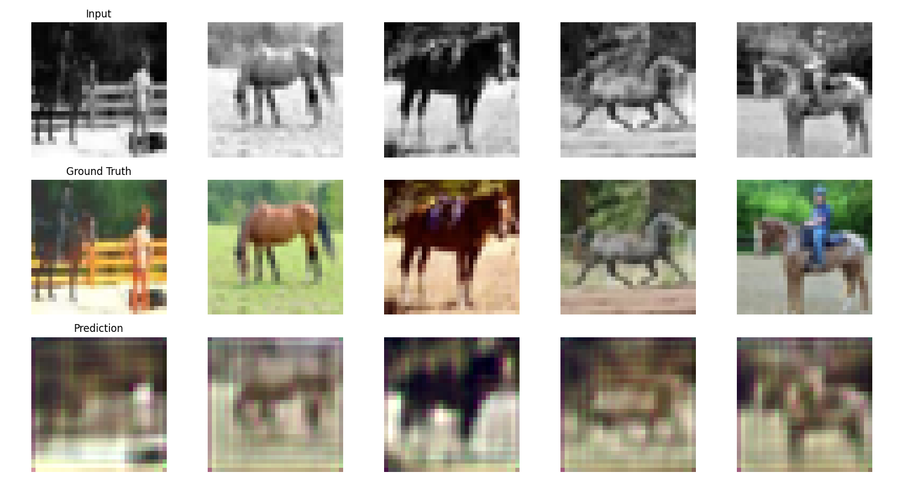
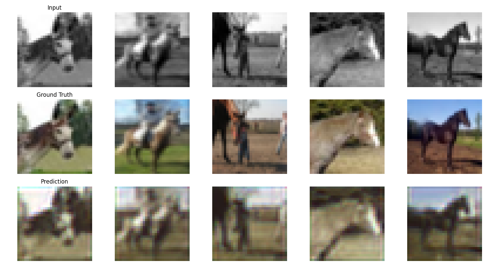
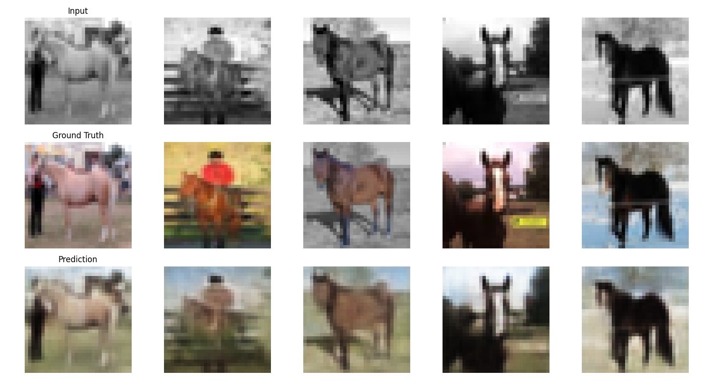

# Image Colorization using CNN, U-Net and Conditional VAE

This project explores image colorization as an image-to-image regression problem using deep learning models.

Given a grayscale image, the goal is to reconstruct the original RGB image. Three different architectures are implemented and compared:

- Convolutional Neural Network (CNN)
- U-Net
- Conditional Variational Autoencoder (CVAE)

The project evaluates both reconstruction quality and generative capability across models.

---

## Demo (Gradio App)

An interactive demo is included to test the models.

Run locally:

Run the Gradio app:
```bash
python src/app/gradio_app.py
```

Then open:
http://127.0.0.1:7860

Upload an image and choose a model (CNN / U-Net / CVAE) to colorize it.

*(Note: Models must be trained first before running the demo.)*

---

## Project Structure

```text

project/
├── src/
│   ├── data/
│   ├── models/
│   ├── training/
│   ├── utils/
│   └── notebooks/
│
├── outputs/
│   ├── images/
│   ├── models/
│   ├── plots/
│   └── metrics/
│
├── requirements.txt
└── README.md
```

---

## Dataset

- CIFAR-10 dataset (32*32 RGB images)
- Only the **horse class** is used for this task

Each image is:
- Converted to grayscale -> input
- Original RGB -> target

---

## Models

### 1. CNN (Baseline)
- Simple encoder-decoder architecture
- Predicts RGB values directly
- Produces reasonable but blurry outputs

### 2. U-Net
- Uses skip connections
- Preserves spatial details
- Produces sharper outputs than CNN

### 3. Conditional Variational Autoencoder (CVAE)
- Learns latent distribution of color
- Generates multiple plausible colorizations
- Balances reconstruction and diversity

---

## Training

- Loss: Mean Squared Error (MSE)
- Optimizer: Adam
- Input: Grayscale image (1 channel)
- Output: RGB image (3 channels)

For CVAE:
- Total Loss = Reconstruction Loss + β × KL Divergence

---

## Evaluation Metrics

- **MSE** – pixel-level reconstruction error  
- **PSNR** – reconstruction quality (higher is better)  
- **SSIM** – structural similarity (perceptual quality)

---

## Results

| Model | Test MSE ↓ | PSNR ↑ | SSIM ↑ |
|------|----------|--------|--------|
| CNN  | 0.0099   | 20.01  | 0.914  |
| U-Net| 0.0070   | 21.50  | 0.938  |
| CVAE | **0.0046** | **23.33** | **0.961** |

---

## Sample Outputs

### CNN


### U-Net


### CVAE


---

## Key Observations

- CNN produces blurry outputs due to lack of spatial detail recovery  
- U-Net improves sharpness using skip connections  
- CVAE achieves the **best quantitative performance (PSNR & SSIM)**  

Trade-off:

- CNN -> simplest baseline  
- U-Net -> good balance of quality and stability  
- CVAE -> best reconstruction + ability to model color uncertainty  

---

## How to Run

Install dependencies:

```bash
pip install -r requirements.txt

python src/training/train_cnn.py
python src/training/train_unet.py
python src/training/train_cvae.py
```
Train models:

```bash
python src/training/train_cnn.py
python src/training/train_unet.py
python src/training/train_cvae.py
```

Outputs will be saved in:

```bash
outputs/
```
---

## Future Improvements

Use perceptual loss (VGG-based)
Implement GAN-based colorization
Improve SSIM with standard implementation
Add FID for generative evaluation
Use higher-resolution datasets

---

## Author
Sohen Patel